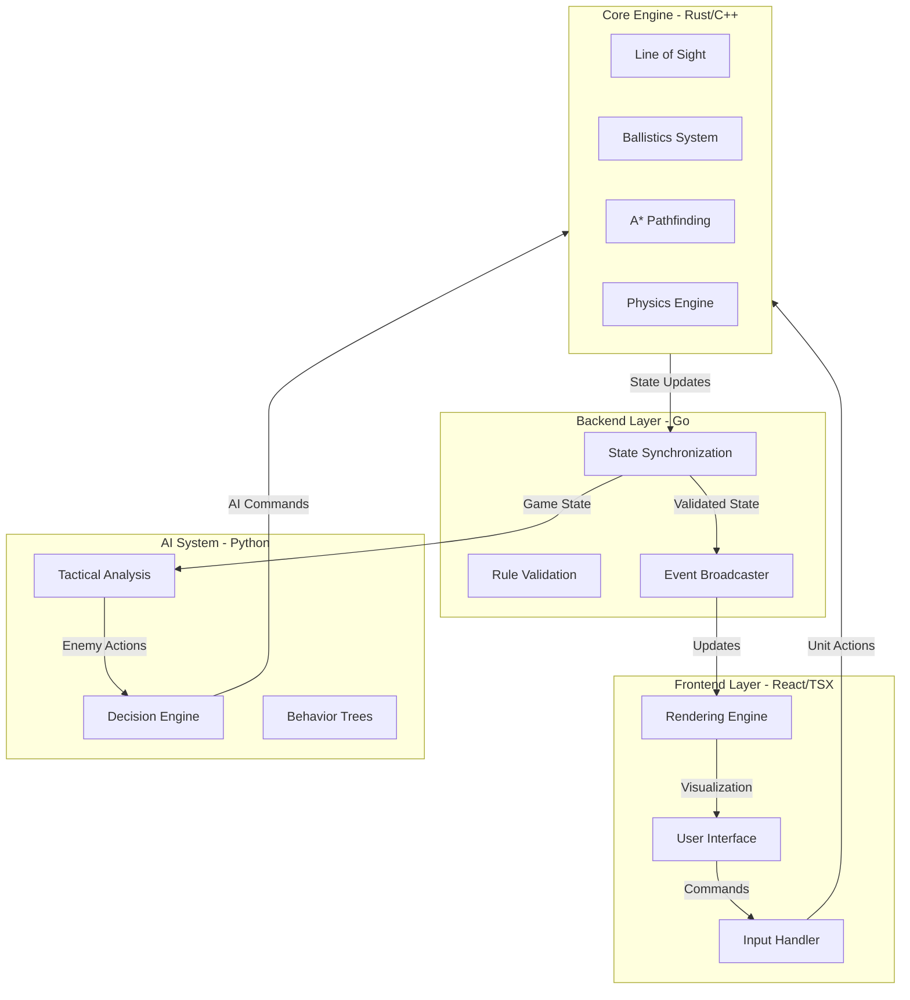

# Design Document: Tactical Combat System

## Overview

The Tactical Combat System is a sophisticated real-time strategy (RTS) combat feature built on a polyglot architecture that leverages specialized languages for optimal performance across different computational domains. The system enables players to deploy military units strategically, engage in realistic combat with physics-based ballistics, and visualize dynamic territory control on hybrid geospatial maps with elevation data.

### Core Design Philosophy

The design follows a separation-of-concerns approach where each subsystem uses the most appropriate technology:

- **Frontend (React/TSX)**: Handles user interaction, visualization, and responsive UI updates
- **Core Engine (Rust/C++)**: Performs computationally intensive real-time calculations (line of sight, ballistics, pathfinding)
- **Backend (Go)**: Manages multiplayer synchronization with efficient concurrency
- **AI System (Python)**: Implements tactical decision-making with flexible scripting

This polyglot approach allows each component to operate at peak efficiency while maintaining clean interfaces between language boundaries.

### Key Features

1. **Drag-and-Drop Unit Deployment**: Intuitive interface for strategic force positioning
2. **Dynamic Frontline Visualization**: Real-time territory boundaries that respond to unit movements
3. **Realistic Combat Simulation**: Physics-based ballistics with armor penetration mechanics
4. **Intelligent Pathfinding**: A* algorithm with collision avoidance and terrain-aware navigation
5. **Multiplayer Synchronization**: Low-latency state updates across distributed clients
6. **Tactical AI**: Adaptive enemy behavior responding to player strategies
7. **Hybrid Geospatial Maps**: Satellite imagery combined with elevation data and navigation meshes
8. **Elevation-Based Tactics**: High ground advantages affecting line of sight and combat effectiveness

### Performance Targets

- 30+ FPS during active combat with 200 units
- <16ms frame time for rendering
- <33ms for all per-frame engine calculations
- <50ms network latency for position updates
- <100ms for territory ownership updates

## Architecture

### System Components



### Communication Patterns

#### Frontend ↔ Core Engine
- **Protocol**: WebAssembly (WASM) for Rust, or FFI bindings for C++
- **Data Flow**: Command messages (move, attack, deploy) from frontend; state updates (positions, health, visibility) from engine
- **Frequency**: Every frame (30-60 Hz)

#### Core Engine ↔ Backend
- **Protocol**: gRPC or Protocol Buffers over WebSocket
- **Data Flow**: Position updates, combat events, territory changes
- **Frequency**: 20 Hz for position updates, event-driven for combat

#### Backend ↔ AI System
- **Protocol**: REST API or message queue (RabbitMQ/Redis)
- **Data Flow**: Game state snapshots to AI; tactical commands from AI
- **Frequency**: 2 Hz for AI decision cycles

#### Backend ↔ Clients
- **Protocol**: WebSocket for bidirectional real-time communication
- **Data Flow**: Client actions to server; authoritative state to all clients
- **Frequency**: 20 Hz with interpolation

### Data Consistency Strategy

The system uses **server-authoritative architecture** to maintain consistency:

1. **Client Prediction**: Frontend predicts local unit movements immediately for responsiveness
2. **Server Validation**: Backend validates all actions against game rules
3. **State Reconciliation**: Clients reconcile predicted state with authoritative server state
4. **Conflict Resolution**: Server state always wins; clients apply corrections smoothly

### Scalability Considerations

- **Horizontal Scaling**: Backend can scale across multiple Go instances with shared state in Redis
- **Spatial Partitioning**: Large maps divided into sectors; only active sectors processed per frame
- **Level of Detail**: Distant units use simplified calculations
- **Culling**: Off-screen units skip rendering but maintain simulation

## Components and Interfaces

### Frontend Interface Component

**Technology**: React 18+ with TypeScript, Canvas API or WebGL for rendering

**Responsibilities**:
- Render game map with satellite imagery and elevation visualization
- Handle drag-and-drop unit deployment
- Display dynamic territory boundaries with color-coded polygons
- Show unit status, health bars, and combat indicators
- Process player input (clicks, drags, keyboard commands)
- Interpolate unit positions between server updates

**Key Interfaces**:

```typescript
interface IFrontendInterface {
  // Deployment Phase
  deployUnit(unitType: UnitType, position: Vector2, facing: number): Result<void, DeploymentError>;
  removeUnit(unitId: string): void;
  getRemainingPoints(): number;
  setDeploymentReady(ready: boolean): void;
  
  // Combat Phase
  issueMovementCommand(unitIds: string[], destination: Vector2): void;
  issueAttackCommand(unitIds: string[], targetId: string): void;
  
  // Visualization
  updateUnitPositions(updates: UnitPositionUpdate[]): void;
  updateTerritoryOwnership(sectors: PolygonSectorUpdate[]): void;
  renderFrame(deltaTime: number): void;
  
  // State Queries
  getVisibleUnits(): Unit[];
  getSelectedUnits(): Unit[];
}

interface UnitPositionUpdate {
  unitId: string;
  position: Vector2;
  facing: number;
  velocity: Vector2;
  timestamp: number;
}

interface PolygonSectorUpdate {
  sectorId: number;
  ownership: Ownership; // Neutral | Player | Enemy
  controlStrength: number; // 0.0 to 1.0
}
```

**Rendering Strategy**:
- Use Canvas API for 2D rendering with layered approach:
  - Layer 0: Satellite imagery/orthomosaic (static, cached)
  - Layer 1: Elevation contours and terrain features
  - Layer 2: Territory polygons with alpha blending
  - Layer 3: Unit sprites and animations
  - Layer 4: UI overlays (health bars, selection indicators)
- Alternative: WebGL with shaders for large-scale maps (10,000+ polygons)

### Core Engine Component

**Technology**: Rust (preferred) or C++ compiled to WebAssembly or native library

**Responsibilities**:
- Calculate line of sight for all units considering terrain and obstacles
- Simulate ballistic trajectories and armor penetration
- Execute A* pathfinding with navigation mesh constraints
- Process combat damage calculations
- Update physics simulation (projectile motion, unit movement)

**Key Interfaces**:

```rust
pub trait ICoreEngine {
    // Line of Sight
    fn calculate_los(&self, observer: &Unit, targets: &[Unit], terrain: &TerrainData) 
        -> Vec<VisibilityResult>;
    
    // Ballistics
    fn simulate_projectile(&mut self, weapon: &Weapon, origin: Vector3, target: Vector3) 
        -> ProjectileTrajectory;
    fn calculate_penetration(&self, projectile: &Projectile, armor: &Armor, angle: f32) 
        -> PenetrationResult;
    
    // Pathfinding
    fn find_path(&self, start: Vector2, goal: Vector2, unit_type: UnitType, navmesh: &NavMesh) 
        -> Option<Path>;
    fn update_paths(&mut self, obstacles: &[Obstacle]) -> Vec<PathUpdate>;
    
    // Combat
    fn process_combat_tick(&mut self, units: &mut [Unit], delta_time: f32) -> Vec<CombatEvent>;
    
    // Performance
    fn get_frame_time_ms(&self) -> f32;
}

pub struct VisibilityResult {
    pub target_id: String,
    pub visible: bool,
    pub distance: f32,
    pub blocked_by: Option<ObstacleType>,
}

pub struct PenetrationResult {
    pub penetrated: bool,
    pub damage: f32,
    pub ricochet_probability: f32,
}
```

**Optimization Techniques**:
- **Spatial Hashing**: Units organized in grid cells for fast neighbor queries
- **Dirty Flags**: Only recalculate LOS when units or terrain change
- **Parallel Processing**: Use Rayon (Rust) or OpenMP (C++) for multi-threaded calculations
- **SIMD**: Vectorize distance and angle calculations
- **Caching**: Store frequently accessed terrain data in hot cache

### Backend Synchronization Component

**Technology**: Go with Gorilla WebSocket or gRPC

**Responsibilities**:
- Accept connections from multiple clients
- Validate player actions against game rules
- Calculate zone of control and territory ownership
- Broadcast state updates to all connected clients
- Handle client disconnections and reconnections
- Maintain authoritative game state

**Key Interfaces**:

```go
type IBackendSync interface {
    // Connection Management
    AcceptClient(conn *websocket.Conn) (*Client, error)
    DisconnectClient(clientID string)
    BroadcastToAll(message []byte) error
    
    // State Management
    UpdateUnitPosition(clientID string, unitID string, pos Vector2) error
    ValidateAction(action PlayerAction) ValidationResult
    GetGameState() *GameState
    
    // Territory Management
    CalculateZoneOfControl(units []Unit) map[int]Ownership
    UpdatePolygonOwnership(zoc map[int]Ownership) []PolygonSectorUpdate
    
    // Synchronization
    SyncPositions(deltaTime float64) error
    SyncTerritory() error
    HandleReconnect(clientID string) error
}

type PlayerAction struct {
    ClientID  string
    ActionType ActionType // Move, Attack, Deploy, etc.
    Payload   interface{}
    Timestamp int64
}

type ValidationResult struct {
    Valid  bool
    Reason string
}
```

**Concurrency Model**:
- One goroutine per client connection for receiving messages
- Central game loop goroutine for state updates (50 Hz tick rate)
- Broadcast goroutine pool for sending updates to clients
- Mutex-protected shared state with read-write locks

### Strategy AI Component

**Technology**: Python 3.10+ with NumPy for numerical operations

**Responsibilities**:
- Analyze current battlefield state
- Identify threats and opportunities
- Generate tactical responses (flanking, retreat, reinforcement)
- Prioritize targets based on threat assessment
- Adapt strategy based on combat outcomes

**Key Interfaces**:

```python
class IStrategyAI(ABC):
    @abstractmethod
    def analyze_battlefield(self, game_state: GameState) -> TacticalAnalysis:
        """Analyze current battlefield situation"""
        pass
    
    @abstractmethod
    def generate_response(self, analysis: TacticalAnalysis) -> List[AICommand]:
        """Generate tactical commands based on analysis"""
        pass
    
    @abstractmethod
    def prioritize_targets(self, enemy_units: List[Unit], friendly_units: List[Unit]) -> List[Target]:
        """Rank enemy units by threat level"""
        pass
    
    @abstractmethod
    def evaluate_terrain(self, position: Vector2, terrain: TerrainData) -> TerrainScore:
        """Assess tactical value of terrain position"""
        pass

@dataclass
class TacticalAnalysis:
    threat_level: float  # 0.0 to 1.0
    recommended_action: TacticalAction  # ATTACK, DEFEND, FLANK, RETREAT
    priority_targets: List[str]  # Unit IDs
    optimal_positions: List[Vector2]
    terrain_advantages: Dict[str, float]

@dataclass
class AICommand:
    unit_id: str
    command_type: CommandType  # MOVE, ATTACK, HOLD
    target: Union[Vector2, str]  # Position or target unit ID
    priority: int
```

**AI Decision Architecture**:
- **Behavior Trees**: Hierarchical decision structure for tactical responses
- **Utility System**: Score-based evaluation of possible actions
- **Influence Maps**: Heatmap of battlefield control and danger zones
- **Threat Assessment**: Weighted scoring based on unit type, position, and health

### Map Data Component

**Technology**: GeoJSON for vector data, PNG/TIFF for raster data

**Responsibilities**:
- Store satellite imagery or orthomosaic visual layer
- Provide digital elevation model (DEM) for height queries
- Define navigation mesh for pathfinding constraints
- Organize polygon sectors for territory visualization

**Data Structure**:

```typescript
interface ITopographicVectorMap {
  // Visual Layer
  imagery: ImageData; // Satellite/orthomosaic
  imageryBounds: GeoBounds;
  
  // Elevation Layer
  dem: DigitalElevationModel;
  getElevation(position: Vector2): number;
  getSlope(position: Vector2): number;
  
  // Navigation Layer
  navMesh: NavigationMesh;
  isTraversable(position: Vector2, unitType: UnitType): boolean;
  getCoverType(position: Vector2): CoverType;
  
  // Territory Layer
  polygonSectors: PolygonSector[];
  getSectorAt(position: Vector2): PolygonSector;
  
  // Metadata
  bounds: GeoBounds;
  resolution: number; // meters per pixel
}

interface DigitalElevationModel {
  width: number;
  height: number;
  heightData: Float32Array; // Z values in meters
  resolution: number; // meters per cell
  
  sample(x: number, y: number): number;
  sampleBilinear(x: number, y: number): number;
}

interface NavigationMesh {
  tankLayer: NavMeshLayer;
  infantryLayer: NavMeshLayer;
  amphibiousLayer: NavMeshLayer;
  
  getCoverFeatures(): CoverFeature[];
}

interface PolygonSector {
  id: number;
  vertices: Vector2[];
  centroid: Vector2;
  ownership: Ownership;
  controlStrength: number;
}
```

**Map Loading Pipeline**:
1. Load satellite imagery and cache in GPU texture
2. Parse DEM data into height array
3. Build navigation mesh from terrain classification
4. Generate polygon sectors using Voronoi tessellation or grid subdivision
5. Precompute sector adjacency graph for fast territory propagation

## Data Models

### Unit Data Model

```typescript
interface Unit {
  // Identity
  id: string;
  type: UnitType; // TANK, INFANTRY, ARTILLERY, etc.
  owner: PlayerId;
  
  // Position and Movement
  position: Vector2;
  elevation: number; // From DEM
  facing: number; // Radians
  velocity: Vector2;
  currentPath: Path | null;
  
  // Combat Stats
  health: number;
  maxHealth: number;
  armor: ArmorProfile;
  weapon: WeaponProfile;
  
  // State
  state: UnitState; // IDLE, MOVING, ATTACKING, DESTROYED
  currentTarget: string | null;
  inCover: boolean;
  coverType: CoverType;
  
  // Visibility
  visibleEnemies: Set<string>;
  lineOfSightRange: number;
  
  // Deployment
  pointCost: number;
}

interface ArmorProfile {
  frontArmor: number; // mm
  sideArmor: number;
  rearArmor: number;
  topArmor: number;
}

interface WeaponProfile {
  name: string;
  projectileType: ProjectileType;
  penetration: number; // mm at 100m
  rateOfFire: number; // rounds per minute
  effectiveRange: number; // meters
  accuracy: number; // 0.0 to 1.0
}

enum UnitType {
  MAIN_BATTLE_TANK,
  LIGHT_TANK,
  INFANTRY_SQUAD,
  MECHANIZED_INFANTRY,
  ARTILLERY,
  ANTI_TANK,
  RECONNAISSANCE,
  AMPHIBIOUS_VEHICLE
}

enum UnitState {
  IDLE,
  MOVING,
  ATTACKING,
  TAKING_COVER,
  RETREATING,
  DESTROYED
}
```

### Combat Event Model

```typescript
interface CombatEvent {
  timestamp: number;
  eventType: CombatEventType;
  data: CombatEventData;
}

enum CombatEventType {
  PROJECTILE_FIRED,
  PROJECTILE_HIT,
  PROJECTILE_MISS,
  ARMOR_PENETRATED,
  ARMOR_DEFLECTED,
  UNIT_DAMAGED,
  UNIT_DESTROYED,
  UNIT_RETREATING
}

interface ProjectileFiredEvent {
  attackerId: string;
  targetId: string;
  projectileId: string;
  trajectory: ProjectileTrajectory;
}

interface ProjectileHitEvent {
  projectileId: string;
  targetId: string;
  hitPosition: Vector3;
  impactAngle: number;
  penetrationResult: PenetrationResult;
  damageDealt: number;
}

interface UnitDamagedEvent {
  unitId: string;
  damage: number;
  remainingHealth: number;
  source: string; // Attacker ID
}
```

### Territory Model

```typescript
interface TerritoryState {
  polygonSectors: Map<number, PolygonSectorState>;
  frontlineBoundary: FrontlineCurve;
  zoneOfControlMap: ZoneOfControlMap;
}

interface PolygonSectorState {
  sectorId: number;
  ownership: Ownership;
  controlStrength: number; // 0.0 to 1.0
  influencingUnits: string[]; // Unit IDs
  lastUpdateTime: number;
}

enum Ownership {
  NEUTRAL,
  PLAYER_1,
  PLAYER_2,
  CONTESTED
}

interface ZoneOfControlMap {
  // Grid-based influence map
  gridWidth: number;
  gridHeight: number;
  cellSize: number; // meters
  influenceGrid: Float32Array; // Positive = player control, negative = enemy control
  
  getInfluence(position: Vector2): number;
  getOwnership(position: Vector2): Ownership;
}

interface FrontlineCurve {
  points: Vector2[];
  smoothed: boolean;
  
  // Calculated from ZOC zero-crossing
  calculateFromZOC(zoc: ZoneOfControlMap): void;
  smooth(iterations: number): void;
}
```

### Game State Model

```typescript
interface GameState {
  // Match Info
  matchId: string;
  phase: GamePhase;
  elapsedTime: number;
  
  // Players
  players: Map<PlayerId, PlayerState>;
  
  // Units
  units: Map<string, Unit>;
  
  // Territory
  territory: TerritoryState;
  
  // Map
  map: ITopographicVectorMap;
  
  // Events
  recentEvents: CombatEvent[];
}

enum GamePhase {
  DEPLOYMENT,
  COMBAT,
  ENDED
}

interface PlayerState {
  id: PlayerId;
  name: string;
  team: number;
  deploymentPoints: number;
  remainingPoints: number;
  deploymentReady: boolean;
  
  // Statistics
  unitsDeployed: number;
  unitsLost: number;
  enemiesDestroyed: number;
  territoryControlled: number; // Percentage
}
```

### Configuration Model

```typescript
interface Configuration {
  // Unit Costs
  unitCosts: Map<UnitType, number>;
  
  // Combat Modifiers
  combatModifiers: CombatModifiers;
  
  // Map Settings
  mapSettings: MapSettings;
  
  // Performance Thresholds
  performance: PerformanceSettings;
}

interface CombatModifiers {
  highGroundDamageBonus: number; // Multiplier
  highGroundAccuracyBonus: number;
  lowGroundAccuracyPenalty: number;
  
  lightCoverDamageReduction: number; // 0.0 to 1.0
  heavyCoverDamageReduction: number;
  
  elevationThresholdMeters: number; // Minimum elevation difference for bonuses
  
  penetrationDistanceFalloff: number; // Per 100m
}

interface MapSettings {
  polygonSectorCount: number;
  demResolution: number; // meters per cell
  navMeshCellSize: number;
  
  deploymentZoneRadius: number; // meters
}

interface PerformanceSettings {
  targetFrameRate: number;
  maxUnits: number;
  maxSimultaneousProjectiles: number;
  
  losCalculationBudgetMs: number;
  ballisticsCalculationBudgetMs: number;
  pathfindingCalculationBudgetMs: number;
  
  networkUpdateRateHz: number;
  territoryUpdateRateHz: number;
}
```

